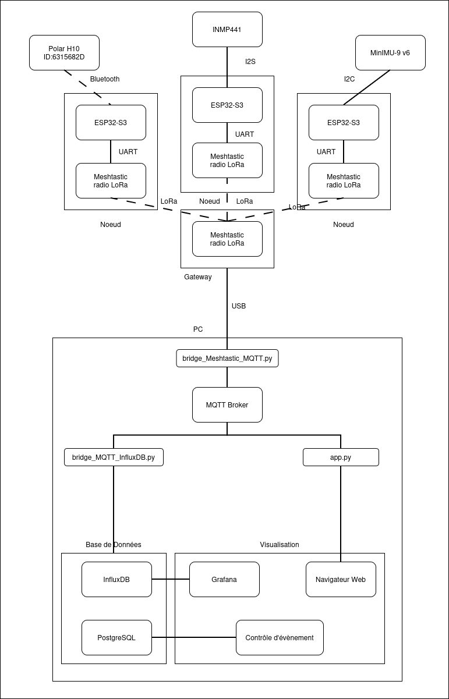
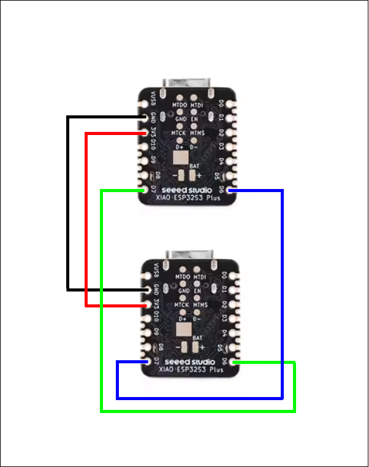
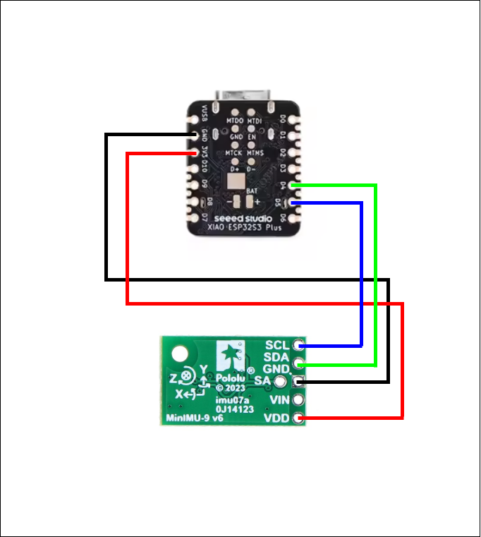
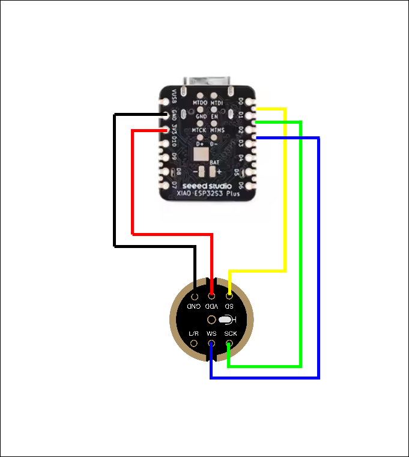

# Architecture

## Description

Le projet de monitoring pour supporters de football a pour objectif de collecter des données sur les supporters pendant un match grâce à une solution IoT. L’architecture globale se compose des composants suivants :
- Capteurs : recueillent les données des supporters.
- Noeuds de données : collecte les données des capteurs et les envois au noeud serveur.
- Noeud serveur : assure la communication entre les noeuds de données et le serveur central.
- Serveur : stocke les données et fournit les services de monitoring et d’analyse.

## Schéma de l'architecture

|  |
|:-----------------------------------------------------------------:|
| Architecture du projet de monitoring pour supporters de football  |

## Protocole de communication

### LoRa

- Technologie radio longue portée pour IoT et communication machine to machine.
- Fréquences typiques : 868MHz (EU).
- Faible consommation énergétique, adaptée à capteurs distants alimentés par batterie.
- Communication point-à-multipoint avec portée jusqu’à plusieurs kilomètres.

### Bluetooth Low Energy

- Technologie sans fil pour communication courte distance à faible consommation d’énergie.
- Utilisée pour connecter smartphones, capteurs, périphériques IoT.
- Transmission de données via paquets numériques sur la bande 2,4GHz.
- Supporte topologies point-à-point, broadcast et mesh.
- Optimisée pour périodes d’inactivité longues, permettant une autonomie élevée.

### I2C

- Protocole filaire pour communication entre microcontrôleurs et périphériques sur courtes distances.
- Utilise 2 fils : SDA (données) et SCL (horloge).
- Permet de connecter plusieurs périphériques sur le même bus grâce aux adresses uniques.
- Communication maître-esclave : le maître initie les échanges, l’esclave répond.
- Supporte des vitesses standard (100kHz), rapide (400kHz), et haute vitesse (3,4MHz).

### I2S

- Protocole filaire dédié à la transmission de données audio numériques entre microcontrôleurs et périphériques audio (microphones, DAC, amplificateurs).
- Utilise généralement 3 à 4 fils :
    - BCLK (Bit Clock) : horloge des bits
    - WS / LRCLK (Word Select) : indique le canal gauche/droite
    - SD (Serial Data) : données audio
    - (optionnel) MCLK (Master Clock) : horloge maître pour certains périphériques
- Transmet des données audio sous forme de flux continu synchronisé, généralement en PCM.
- Architecture maître-esclave :
    - Le maître génère les horloges (BCLK, WS)
    - Le périphérique (micro ou DAC) suit la synchronisation
- Supporte plusieurs formats audio :
    - 16, 24 ou 32 bits par échantillon
    - Mono ou stéréo
- Fréquences d’échantillonnage courantes :
    - 8 kHz (voix basse qualité)
    - 16 kHz (voix)
    - 44,1 kHz (qualité CD)
    - 48 kHz (standard audio)

## Schéma de montage des capteurs

|  |
|:----------------------------------------------------------------:|
| Schéma de montage du module LoRa                                 |

|  |
|:-----------------------------------------------------------------:|
| Schéma de montage du capteur MinIMU-9 v6                          |

|  |
|:---------------------------------------------------------:|
| Schéma de montage du capteur INMP441                      |
